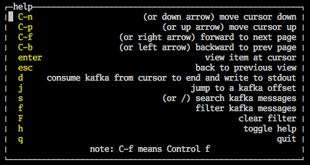

# kcli
Kcli is a kafka read only command line browser.

## Install

Binaries are provided [here](https://github.com/cswank/kcli/releases/tag/1.1.0) (windows
is not tested).  If you have go installed you can do:

    $ go get -u github.com/cswank/kcli

## Usage

    $ kcli --help
    usage: kcli [<flags>]

    Flags:
          --help       Show context-sensitive help (also try --help-long and --help-man).
      -a, --addresses=localhost:9092 ...
                       comma seperated list of kafka addresses
      -l, --logs=LOGS  for debugging, set the log output to a file

Once you start kcli type 'h' to see the help menu:

If you don't like the colors you can set KCLI_COLOR[1,2,3] to one of:

* black
* red
* green
* yellow
* blue
* magenta
* cyan
* white

For example:

    $ KCLI_COLOR1=red KCLI_COLOR2=yellow kcli

See it in action at [asciinema](https://asciinema.org/a/7wobtflusydvswbsn1d320o1g)

NOTE: If you are connecting to a local kafka that is running in a docker container
using wurstmeister/kafka you may have the env KAFKA_ADVERTISED_HOST_NAME set to
a name that is used by other containers that need to connect to kafka.  This will
cause kcli to not be able to read from kafka.  A hacky fix is to edit your /etc/hosts
file and add another name to the 127.0.0.1 network interface.  For example, if

    KAFKA_ADVERTISED_HOST_NAME=kafka

Then the 127.0.0.1 line /etc/hosts should look like:

    127.0.0.1       localhost kafka
