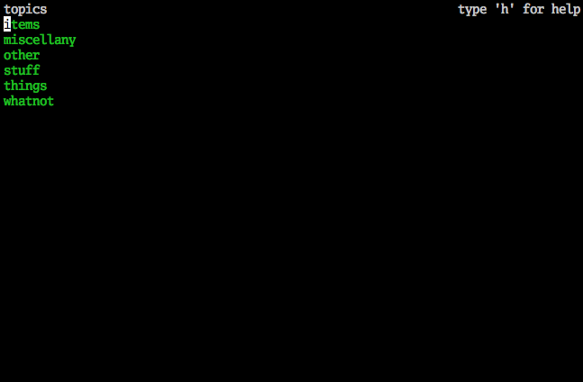
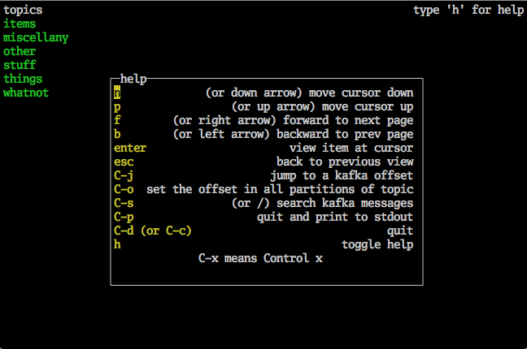
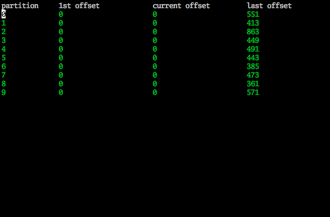
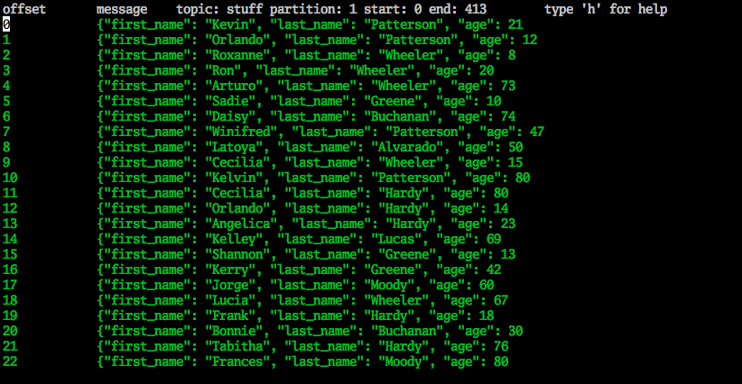
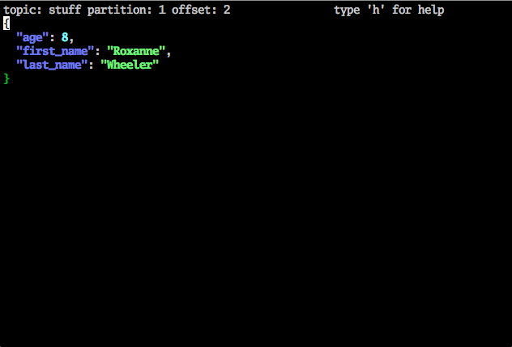
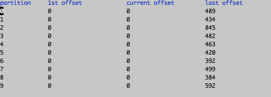

# kcli
Kcli is a kafka read only command line browser.

## Install

Binaries are provided [here](https://github.com/cswank/kcli/releases/tag/1.4.1) (windows
is not tested).  If you have go installed you can do:

    $ go get -u github.com/cswank/kcli

## Usage

	kcli --help
	usage: kcli [<flags>]

	Flags:
	      --help          Show context-sensitive help (also try --help-long and --help-man).
	  -a, --addresses=localhost:9092 ...
	                      comma seperated list of kafka addresses
	  -l, --log=LOG       for debugging, set the log output to a file
	  -t, --topic=TOPIC   go directly to a topic
	  -p, --partition=-1  go directly to a partition of a topic
	  -o, --offset=-1     go directly to a message

After starting it up you get a list of topics:

Type 'h' to see the help menu (type 'h' again to toggle the help menu off):

Navigate to a topic and hit enter to see the partitions:

Navigate to a partition and hit enter to see a page of messages:

And navigate to a message and hit enter to see the message:

### Searching
You can search for a string on either a partition or topic.  When you search
on a partition then the current offset is set to the first message that
contains the search string.  When you search on a topic then only the topics
that contain a match are printed to the screen and their current offset is
set to the first message that contains that match.

If you have partitions that have large amounts of data then it can take a
long time to search through all the partitions.  It is sometimes useful
to use the partition offset functionality (C-o) to speed up your
search if you have an idea where the message might be.  If you know the message
you are searching for is fairly recent then you can use a negative offset to set
the offset of each partition close to then last end.  The search will then start
from those offsets.

### Jumping
You can use the jump command (C-j) to set the current offset of a partition.
Jumping on a partition is simple: the number you enter becomes the current offset.
On other views (topic and message views) jump navigates the cursor to the value
you enter.

### Printing
If you enter C-p kcli will exit and the contents of the current view will be printed to
stdout.  If the current view is a partition then each message from the cursor to the end
of the partition is printed to stdout.  This is useful if you want to process the messages,
for example:

    kcli | jq .age | awk '{s+=$1} END {print s}'

Assuming the messages that get printed are JSON, this print the sum of all age fields
from each message in the partition.

### Screen Colors

If you don't like the defaul colors you can set KCLI_COLOR[0,1,2,3] to one of:

* black
* red
* green
* yellow
* blue
* magenta
* cyan
* white

For example:

    $ KCLI_COLOR0=white KCLI_COLOR1=blue KCLI_COLOR2=black KCLI_COLOR3=red

See it in action at [asciinema](https://asciinema.org/a/wTeIxxlIhgQzSQv9mIAG689sP)

NOTE: If you are connecting to a local kafka that is running in a docker container
using wurstmeister/kafka you may have the env KAFKA_ADVERTISED_HOST_NAME set to
a name that is used by other containers that need to connect to kafka.  This will
cause kcli to not be able to read from kafka.  A hacky fix is to edit your /etc/hosts
file and add another name to the 127.0.0.1 network interface.  For example, if

    KAFKA_ADVERTISED_HOST_NAME=kafka

Then the 127.0.0.1 line /etc/hosts should look like:

    127.0.0.1       localhost kafka
